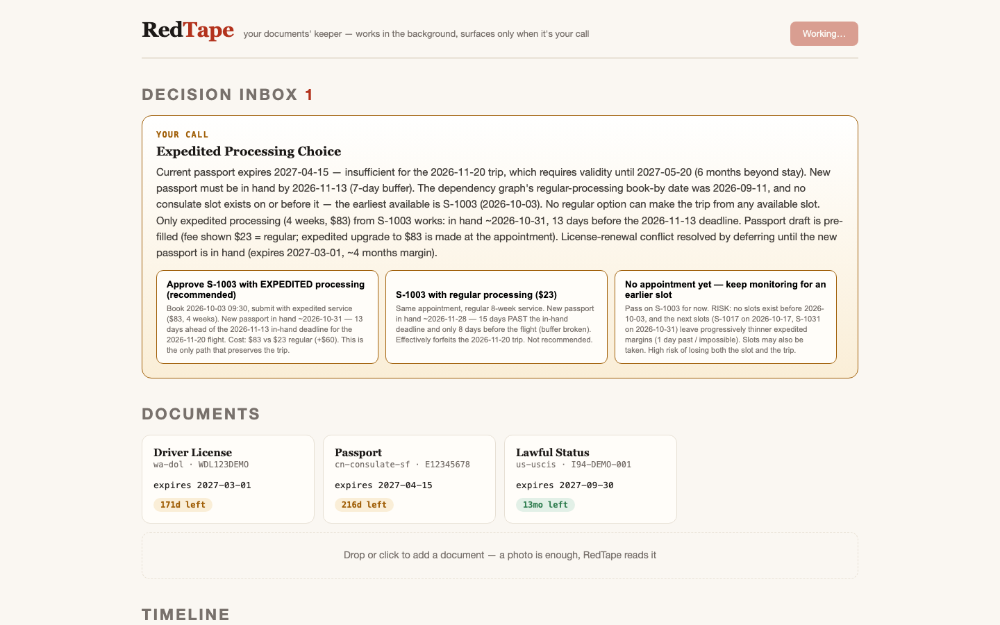
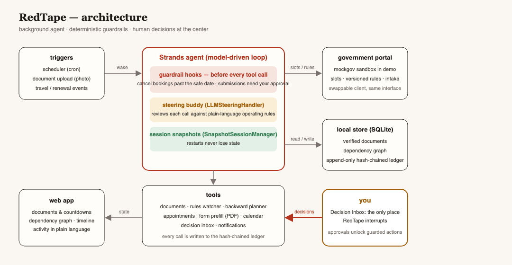

# RedTape

**An autonomous agent that guards the dependency chain of your cross-border documents — passport, visa, permit, license — and handles renewals end to end in the background, surfacing only when a real decision needs you.**

Built with the [Strands Agents SDK](https://strandsagents.com/) · Agents for Humans Hackathon, **Everyday Agents** track.

## The problem

For people who live across borders, life admin is not a reminder list — it is a dependency graph. A driver's-license renewal needs a valid passport and lawful status. A visa stamp needs six months of passport validity. A consulate appointment books out weeks ahead, and the renewal itself takes 4–8 weeks during which **you don't have your passport**. Miss one window and the chain cascades: lost status, fines, or no way to fly home for an emergency.

Reminder apps tell you a date is coming. RedTape computes your deadlines *backwards* from the constraints, does the safe work itself — checks the rules, books the appointment, pre-fills the forms, holds the calendar — and only interrupts you when a decision is genuinely yours.

## See it run

```bash
git clone <repo-url> && cd redtape
uv venv && uv pip install -e ".[dev]"        # or: python -m venv .venv && pip install -e ".[dev]"
export KIMI_CODE_API_KEY=...                  # any Strands-supported model key; see Configuration

bash scripts/demo.sh                          # one command: sandbox + web app + demo persona, opens the UI
```

Or step by step:

```bash
# terminal 1 — the sandboxed government portal (deterministic demo environment)
uvicorn mockgov.app:app --port 9100

# terminal 2 — the product
python scripts/seed_persona.py                # synthetic demo persona, no real data
uvicorn redtape.server:app --port 9200        # open http://localhost:9200
```

Press **Run a check** in the UI. RedTape scans the document ledger, re-verifies the rules, computes the backward-chained plan, books a valid appointment, pre-fills the application (JSON + PDF draft), places calendar holds — and if a choice is irreversible or costs money, it stops and asks you in the **Decision Inbox**.



The demo environment (`mockgov/`) simulates the consulate/DMV portal so the whole loop runs offline and deterministically. The agent's reasoning, document parsing, form pre-fill, guardrails, and decision flow are real; the portal client is the only simulated piece, isolated behind one interface.

## What makes it an agent, not a reminder

- **Dependency-graph planning** — deadlines are computed backwards from *when the document must be in hand*, through processing time and appointment lead, not forwards from an expiry date. Cross-renewal conflicts (passport surrendered while the license renewal needs it) are detected explicitly.
- **Background by design** — a daemon wakes the agent on a schedule or on triggers; there is no chat to babysit. After each wake the daemon verifies the cycle reached a terminal state (a booking landed, or a decision is pending/executed, or the plan required nothing) and nudges the agent once if it ended early — an empty model finish can't silently stall the chain.
- **Deterministic guardrails** — Strands **hooks** cancel any booking that lands after the graph-computed safe date, and cancel any application submission not explicitly approved by you; an approved decision unlocks exactly the slots it names (even when the model buries the slot id in prose). Watch the hook fire in the Activity feed.
- **A steering buddy** — Strands' `LLMSteeringHandler` reviews each tool call against natural-language operating rules and guides the agent back when it drifts. RedTape subclasses it to degrade "interrupt for human" decisions into guidance: a background agent must never suspend mid-turn waiting for a human — the Decision Inbox is the only human-input channel.
- **Auditable everything** — every action lands in a hash-chained ledger you can verify (`verify_ledger()`); sessions persist across restarts via `SnapshotSessionManager`. The store runs in WAL mode with serialized access, so the web server, daemon, and CLI checks can share one database without starving each other's writes.
- **Photo intake** — point a camera at a document; the vision model extracts the fields, you confirm, the agent takes it from there.

## Architecture



```
scheduler ── wakes ──▶ Strands agent ──▶ tools: documents · rules · plans · booking · forms · calendar
                           │  ▲                     guardrail hooks cancel unsafe calls before they run
                           │  └── steering buddy reviews every tool call
                           ▼
                    Decision Inbox (the only interruption)  ·  hash-chained action ledger
```

## Evaluation

`python -m evals.run` drives scripted scenarios (cascade required, no-action-when-valid, tight margins, unconfirmed data, idle wake) against a fresh store and asserts on **outcome state** — bookings made within safe dates, escalations surfaced, and zero unauthorized submissions. Latest report: `evals/reports/last-run.json`.

## Configuration

| env var | default | purpose |
|---|---|---|
| `KIMI_CODE_API_KEY` | — | model key (dev/demo default: Kimi K2.7) |
| `REDTAPE_PROVIDER` | `kimi` | `kimi` or `bedrock` (AgentCore path) |
| `REDTAPE_MODEL_ID` | `kimi-for-coding` | model override |

## License

MIT — see [LICENSE](LICENSE).
